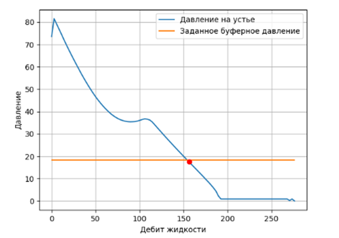

Упрощения к задачам:
1. Для упрощения считаем, что скважина работает через точку ввода газа и входной расход = расходу через
клапан при переводе в стандартные условия.
2. При расчёте учитывайте, что температура меняется согласно геотермическому градиенту (нет теплопотерь).
Считаем, что коэффициент продуктивности и пластовое давление постоянны.

Задача 1: определение минимального забойного давления фонтанирования скважины
1. Считываем данные из JSON-файла
2. Задаем с шагом 100 забойное давление
3. По корреляции рассчитываем свойство флюида
4. Определяем структуру потока и потери на трение
5. Рассчитываем перепад давление на выбранном шаге
6. Строим график буферного давления и VLP, находим пересечение

7. Определяем дебет при минимальном забойном давлении, находим мин забойное давление

Задача 2: определение оптимального расхода газлифтного газа и определить оптимальный
расход газлифтного газа
 1. Строим IPR
 2. Строим VLP для конкретного расхода
 3. Находим пересечение для конкретного расхода
 4. Повторяем пункт 2-3 для всех расходов и строим зависимость дебита жидкости и забойного давления
 от расхода
 5. Находим максимум на кривой